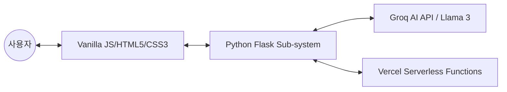

# [Program Specification] Edu-Calc AI: 단계별 학습형 공학계산기

**작성자:** Software Architect (25년 경력)  
**날짜:** 2026-03-09  
**상태:** Draft (v1.0)

---

## 1. 프로젝트 개요 (Project Overview)

### 1.1 목적
**Edu-Calc AI**는 단순한 연산 결과 도출을 넘어, 사용자의 학습 수준에 맞춘 **맞춤형 교육 및 개념 내재화**를 목적으로 하는 차세대 학습 보조 도구입니다. 복잡한 수식을 해결하는 과정에서 발생하는 '이해의 공백'을 AI 기술로 메워 학습 효과를 극대화합니다.

### 1.2 기대 효과
- **자기주도 학습 강화**: 정답뿐만 아니라 원리와 유사 문제를 제공하여 학습자의 문제 해결 능력 향상.
- **수준별 맞춤 교육**: 초등학생부터 대학생까지 각기 다른 언어와 개념으로 설명하여 진입 장벽 완화.
- **접근성 향상**: 자연어 입력을 통한 직관적인 공학 계산 경험 제공.

---

## 2. 주요 기능 (Feature List)

| 기능명 | 상세 설명 | 비고 |
| :--- | :--- | :--- |
| **자연어 수식 변환** | "루트 2더하기 3의 제곱은 뭐야?"와 같은 일상어를 수식으로 변환 및 계산. | Groq AI 활용 |
| **4단계 수준별 설명** | 초/중/고/대학 수준에 맞춘 답변 톤앤매너 및 용어 선택. | 시스템 프롬프트 제어 |
| **핵심 개념 요약** | 해당 수식에 적용된 수학/공학적 핵심 원리를 3줄 내외로 정리. | 지식 증류 |
| **유사 문제 생성** | 풀이한 문제와 유사한 원리의 새로운 문제를 생성하여 복습 기회 제공. | Interactive Learning |

---

## 3. 시스템 아키텍처 (System Architecture)

본 시스템은 가볍고 빠른 응답성을 위해 **Serverless-friendly** 구조를 채택합니다.



- **Frontend**: 가벼운 실행을 위해 Vanilla JS 사용. MathJax/KaTeX를 통한 수식 렌더링.
- **Backend (Flask)**: API 라우팅, 사용자 세션 관리, 프롬프트 템플릿 처리 역할.
- **AI Engine (Groq)**: 초고속 추론 기능을 제공하는 Groq 인프라 위에서 Llama 3 모델 가동.

---

## 4. UI/UX 설계 방향

### 4.1 '편한 말투'형 인터페이스
- **대화형 입력창**: 텍스트 및 음성(STT 확장 고려)으로 수식을 입력할 수 있는 유연한 입력 필드.
- **반응형 결과 카드**: 결과값, 개념 설명, 유사 문제가 각각 독립적인 카드 형태로 시각화되어 가독성 확보.

### 4.2 결과 시각화
- **단계별 풀이 (Step-by-Step)**: 아코디언 컴포넌트를 사용하여 사용자가 원하는 경우에만 상세 풀이 과정을 확인 가능하게 설계.

---

## 5. 데이터 스키마 및 프롬프트 엔지니어링 전략

### 5.1 시스템 프롬프트 구조 (System Prompt Strategy)
Groq AI에게 전달할 페르소나와 규칙을 아래와 같이 설계합니다.

```text
[Role]
You are a world-class math tutor for {Level}.

[Constraint]
1. Explain concepts using terminology appropriate for a {Level} student.
2. Provide: (1) Result, (2) Core Concept, (3) Detailed Explanation, (4) One Similar Practice Problem.
3. Level Mapping:
   - Elementary: Use visual analogies, simple words.
   - University: Use formal proofs, derivative notations.
```

### 5.2 수준별 타겟팅
- **초등**: 과일이나 초콜릿 등 구체적인 사물 비유.
- **대학**: 정의(Definition), 정리(Theorem), 증명(Proof) 중심의 학술적 접근.

---

## 6. 배포 및 운영 계획 (Deployment Plan)

### 6.1 CI/CD 워크플로우
1. **Source Control**: GitHub Private/Public Repository.
2. **Build & Deploy**: Vercel의 GitHub Integration을 통한 자동 배포.
   - `main` 브랜치 푸시 시 Vercel에서 Flask 환경 감지 및 배포 (Vercel Python Runtime 활용).

### 6.2 보안 관리
- **API Key 관리**: Groq API 키는 Vercel 환경 변수(`.env`)로 안전하게 관리.

---

## 7. 로드맵 (Roadmap)
- **Phase 1**: 핵심 계산 및 수준별 텍스트 답변 기능 구현 (MVP).
- **Phase 2**: 수식 렌더링(KaTeX) 및 유려한 CSS 애니메이션 적용.
- **Phase 3**: 사용자별 풀이 이력 저장 및 오답 노트 기능 추가.
